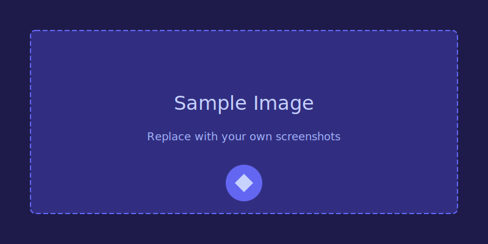

This post demonstrates how to add images to your blog posts.

## Co-located Images

Place images in the same folder as your post:

```
content/
  blog/
    my-post/
      index.md      ← Your post content
      screenshot.png ← Co-located image
```

Then reference them with a relative path:

```markdown

```

The `ProseImg` component automatically:
- Converts to WebP format
- Lazy loads images
- Adds the alt text as a figcaption
- Applies consistent styling

## Example

Here's a placeholder for testing (replace with an actual image):



## Tips

- Use descriptive alt text for SEO and accessibility
- Keep images in the same folder as the post for easy management
- The alt text becomes the caption automatically
